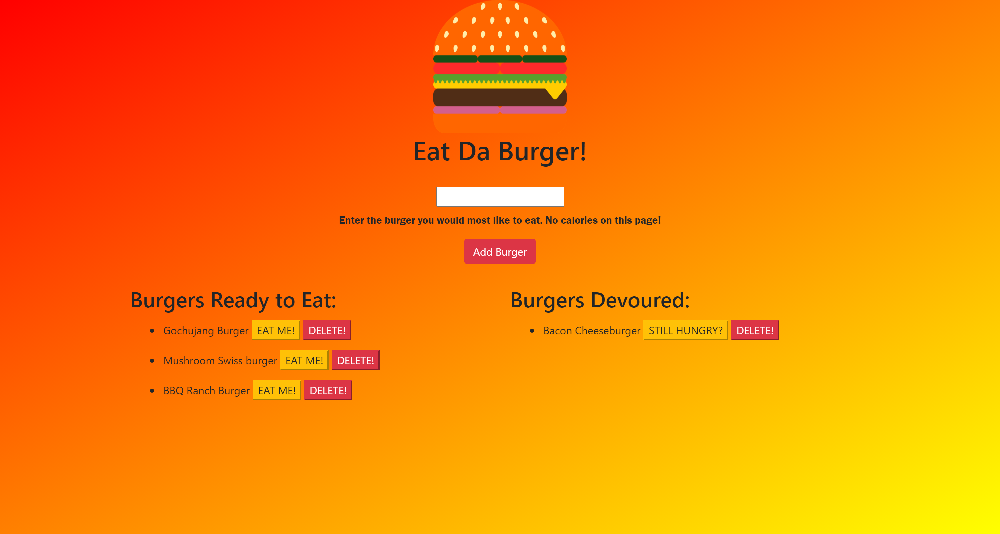

# Eat Da Burger 

  
  
  ## Table of Contents
  - [Description](#description)
  - [Installation](#installation)
  - [Usage](#usage)
  - [Contributing](#contributing)
  - [Tests](#tests)
  - [Questions](#questions)
  - [License](#license)

  ### Description
  This project combines Javascript, MySQL, Handlebars, and Heroku to serve up the burger of your dreams.  Simply enter the burger you'd like to eat and devour at will.  Check out the live site at [Eat Da Burger](https://shielded-falls-19006.herokuapp.com/).
  
  ### Installation
  No need to install. You can deploy the app live.
  
  ### Usage
  This is an open page for anyone to enjoy.  Type in the name of the burger and click "Add Burger."  If you'd like to eat the burger, click the button that says "Devour It."  The burger will be moved to the Devoured list.  Click "Still Hungry" to move the burger back to the Ready to Eat list, or click Delete if you're done with the burger. 
  
  ### Contributing
  If you have any ideas to make this project better, feel free to fork the repo and take a look.  If you'd like to add something, submit a pull request to me.
  
  ### Tests
  I've run the app in Heroku, and it's fully compatible.
  
  ### Questions
  For questions, please check out my [GitHub](https://github.com/Jacquie24) page first.  If you have any further questions, you can email me directly at jgcaption@yahoo.com.
  
  ### License
  This page uses the [MIT](https://choosealicense.com/licenses/mit/) license.